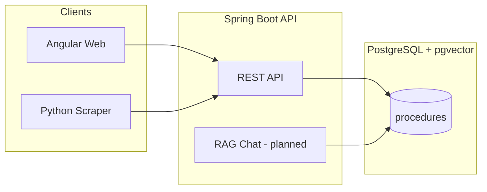

# Dosya دوسيا

**Stop guessing. Start knowing.**

Dosya is a civic tech platform that helps Tunisian citizens navigate government bureaucracy. Every answer is grounded in **verified procedure data** stored in PostgreSQL — not improvised by AI.

> **دوسيا** — "file / dossier" in Tunisian Arabic.

<p align="center">
  
</p>

---

## Why Dosya?

| Problem | Dosya's approach |
|---------|------------------|
| Procedures scattered across ministries | Single searchable catalog |
| Word-of-mouth, outdated info | Versioned records with `sourceUrl` + `lastVerifiedAt` |
| Generic chatbots invent facts | RAG over verified `Procedure` records only |
| French / Arabic / dialect mix | Bilingual fields as first-class data |

---

## UI preview

Design mockups live in [`design--/`](design--/) (open the HTML files in a browser for full UI). Visual assets:

<p align="center">
  
  <br/><em>Structured guidance — every procedure as a verified checklist</em>
</p>

<p align="center">
  
  <br/><em>Office locations — know where to go before you leave home</em>
</p>

<p align="center">
  
  <br/><em>AI assistant (planned) — grounded answers with sources, never invented facts</em>
</p>

Full Stitch screens: `design--/Image 13.html` (library), `Image 7.html` (detail), `Image 11.html` (chat).

---

## Architecture



---

## Tech stack

| Layer | Technology |
|-------|------------|
| Backend | Spring Boot 4, Java 21 |
| Database | PostgreSQL 17 + pgvector |
| Migrations | Flyway |
| Frontend | Angular (planned) |
| AI / RAG | Gemini + pgvector (planned) |
| Scraper | Python 3, BeautifulSoup, Requests |

---

## Brand palette — Modern Tunisia

| Name | Hex | Usage |
|------|-----|--------|
| Primary (Carthage Gold) | `#7e5700` | CTAs, headings |
| Primary Container | `#c8922a` | Accents |
| Secondary | `#446274` | Ministry tags |
| Background | `#fef9f1` | Page background |
| Success | `#3B6D11` | Checklist items |

---

## Project structure

```
dossia/
├── src/main/java/com/example/dossia/
│   ├── procedure/          # Domain, API, service layer
│   ├── common/             # Exceptions, health check
│   └── config/             # CORS
├── src/main/resources/db/migration/   # Flyway SQL
├── scraper/                # Data ingestion pipeline
│   ├── data/draft/         # JSON procedures awaiting import
│   ├── import_to_api.py    # Push drafts to admin API
│   └── sources/            # Per-ministry scrapers
├── design--/               # Stitch UI HTML mockups
└── docker-compose.yml      # Optional Postgres + pgvector
```

---

## Quick start

### Prerequisites

- Java 21+
- Maven (or use `./mvnw`)
- PostgreSQL 17 with [pgvector](https://github.com/pgvector/pgvector)
- Python 3.11+ (for scraper)

### 1. Create the database

In pgAdmin or `psql` as superuser:

```sql
CREATE DATABASE dossia;
\c dossia
CREATE EXTENSION IF NOT EXISTS vector;
```

### 2. Configure credentials

Copy the example local config and set your Postgres password:

```bash
cp src/main/resources/application-local.yml.example src/main/resources/application-local.yml
```

Edit `application-local.yml`:

```yaml
spring:
  datasource:
    password: your-postgres-password
```

Or use environment variables:

```bash
export POSTGRES_USER=postgres
export POSTGRES_PASSWORD=your-password
export POSTGRES_DB=dossia
```

### 3. Run the API

```bash
./mvnw spring-boot:run
```

Flyway creates tables and seeds 5 sample procedures on first run.

### 4. Verify

```bash
curl http://localhost:8080/api/v1/health
curl http://localhost:8080/api/v1/procedures
curl http://localhost:8080/api/v1/procedures/national-id-card-renewal
```

---

## API endpoints

### Public

| Method | Endpoint | Description |
|--------|----------|-------------|
| `GET` | `/api/v1/health` | Health check |
| `GET` | `/api/v1/procedures` | List published procedures (`?q=&category=&lang=fr`) |
| `GET` | `/api/v1/procedures/categories` | Category filter chips |
| `GET` | `/api/v1/procedures/{slug}` | Full detail (docs, steps, offices) |

### Admin (ingestion)

| Method | Endpoint | Description |
|--------|----------|-------------|
| `GET` | `/api/v1/admin/procedures?status=DRAFT` | List drafts |
| `POST` | `/api/v1/admin/procedures` | Create procedure |
| `POST` | `/api/v1/admin/procedures/import` | Bulk import JSON |
| `PATCH` | `/api/v1/admin/procedures/{id}/verify` | Verify & publish |

---

## Data ingestion (scraper)

### Source priority

| Source | Type | Mode | Notes |
|--------|------|------|-------|
| [demarches.tn](https://demarches.tn) | Community | **Auto scrape** | Primary scraper — always DRAFT + human verify |
| [services.gov.tn](https://www.services.gov.tn) | Official | Manual / partnership | Best reference content; verify demarches data here |
| interieur.gov.tn | Official | Manual | CIN, passport — page by page |
| fr.tunisie.gov.tn | Official | Manual | Ministry directory |
| opendata.interieur.gov.tn | Open data | Browse datasets | Check for structured procedure data |

Registry: [`scraper/sources/sources.yaml`](scraper/sources/sources.yaml)

```bash
cd scraper
pip install -r requirements.txt

# Scrape demarches.tn (auto)
python -m sources.demarches_tn --discover --limit 5
python -m sources.demarches_tn --url https://demarches.tn/some-article/

# Import to API
python import_to_api.py
python import_to_api.py --list-drafts
python import_to_api.py --verify passport-request   # publish after review
```

**Workflow:** scrape → normalize to JSON → human review → import → verify → live.

JSON schema: [`scraper/schema/procedure-import.schema.json`](scraper/schema/procedure-import.schema.json)

> Sample seed data and draft JSON files are **hand-written placeholders** for pipeline testing. Real ministry parsers are built per source site.

---

## Core principle

```
Structured verified data = source of truth
AI = interface only (RAG retrieval, never freeform facts)
```

Every chat answer must cite `sourceUrl` and `lastVerifiedAt`.

---

## Roadmap

- [x] Phase 1 — Spring Boot API, PostgreSQL, Flyway, Procedure CRUD
- [x] Phase 2a — Scraper pipeline, bulk import, draft workflow
- [ ] Phase 2b — Real parsers (`services.tn`, `interieur.gov.tn`, `apii.tn`)
- [ ] Phase 3 — Embeddings + pgvector semantic search
- [ ] Phase 4 — RAG chat endpoint (Gemini)
- [ ] Phase 5 — Angular frontend from `design--/` mockups

---

## License

TBD

---

<p align="center">
  <strong>Dosya دوسيا</strong> — Navigating Tunisian bureaucracy, made simple.
</p>
