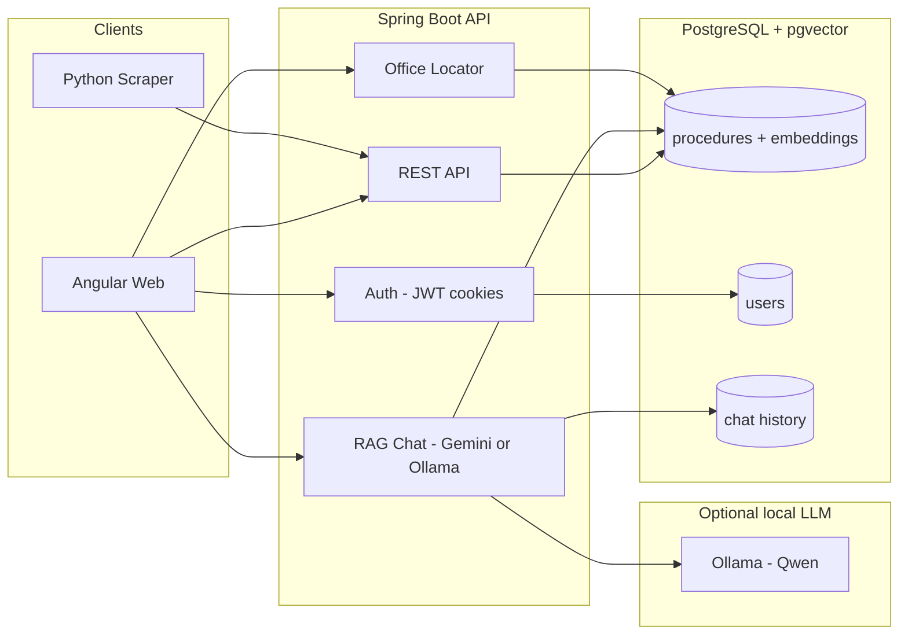

# Dosya دوسيا

**Stop guessing. Start knowing.**

Dosya is a civic tech platform that helps Tunisian citizens navigate government bureaucracy — passeport, CIN, équivalence de diplôme, résidence, and more. Every answer is grounded in **verified procedure data** stored in PostgreSQL — not improvised by AI.

Talk to it in **French, English, or Tunisian Derja** with voice guides (Sofia · Yasmine · Alex). Ask where to go, what papers you need, and get step-by-step guidance with sources.

> **دوسيا** — "file / dossier" in Tunisian Arabic.

<p align="center">
  
</p>

---

## Why Dosya?

| Problem | Dosya's approach |
|---------|------------------|
| Procedures scattered across ministries | Single searchable catalog |
| Word-of-mouth, outdated info | Versioned records with `sourceUrl` + `lastVerifiedAt` |
| Generic chatbots invent facts | RAG over verified `Procedure` records only |
| French / Arabic / dialect mix | FR · AR · Tunisian Derja (incl. voice agents) |
| “Where do I go?” | Nearest offices on a map when you ask |

---

## UI preview

Design mockups live in [`design--/`](design--/) (open the HTML files in a browser for full UI). Visual assets:

<p align="center">
  
  <br/><em>Structured guidance — every procedure as a verified checklist</em>
</p>

<p align="center">
  
  <br/><em>Office locations — know where to go before you leave home</em>
</p>

<p align="center">
  
  <br/><em>AI assistant — grounded answers with sources, never invented facts</em>
</p>

Full Stitch screens: `design--/Image 13.html` (library), `Image 7.html` (detail), `Image 11.html` (chat).

---

## Architecture



---

## Tech stack

| Layer | Technology |
|-------|------------|
| Backend | Spring Boot 4, Java 21 |
| Database | PostgreSQL 17 + pgvector |
| Migrations | Flyway |
| Frontend | Angular 19 (standalone components) |
| AI / RAG | Gemini **or** Ollama (`qwen2.5:7b-instruct` + `nomic-embed-text`), hybrid retrieval over pgvector |
| Voice | Browser STT/TTS + agents (Sofia FR · Yasmine TN · Alex EN) |
| Auth | JWT in HttpOnly cookies, Spring Security |
| Maps | Leaflet + OSRM routing |
| Scraper | Python 3, BeautifulSoup, Requests |
| Infra | Docker Compose (Postgres + Ollama) |

---

## Brand palette — Modern Tunisia

| Name | Hex | Usage |
|------|-----|--------|
| Primary (Carthage Gold) | `#7e5700` | CTAs, headings |
| Primary Container | `#c8922a` | Accents |
| Secondary | `#446274` | Ministry tags |
| Background | `#fef9f1` | Page background |
| Success | `#3B6D11` | Checklist items |

---

## Project structure

```
dossia/
├── src/main/java/com/example/dossia/
│   ├── procedure/          # Domain, API, service layer
│   ├── auth/               # JWT cookie auth, users, security
│   ├── chat/               # RAG chat (Gemini/Ollama), retrieval, history, voice agents
│   ├── office/             # Office locator (nearest service point)
│   ├── common/             # Exceptions, health check
│   └── config/             # CORS, auth & gemini properties, beans
├── src/main/resources/db/migration/   # Flyway SQL (V1–V8)
├── frontend/               # Angular 19 app (see frontend/README.md)
├── scraper/                # Data ingestion pipeline
│   ├── data/draft/         # JSON procedures awaiting import
│   ├── import_to_api.py    # Push/verify drafts (authenticates as admin)
│   └── sources/            # Per-ministry scrapers
├── design--/               # Stitch UI HTML mockups
├── .env.example            # Copy to .env (shared by app + compose)
└── docker-compose.yml      # Postgres + pgvector
```

---

## Quick start

### Prerequisites

- Java 21+
- Maven (or use `./mvnw`)
- PostgreSQL 17 with [pgvector](https://github.com/pgvector/pgvector) (or `docker compose up`)
- Node 20+ and npm (for the Angular frontend)
- Python 3.11+ (for scraper)
- A Gemini API key **or** Ollama (self-hosted LLM) for chat + embeddings

### 1. Configure environment

Copy the example env file and fill in your values (this file is read by **both** Spring Boot and docker-compose):

```bash
cp .env.example .env
# then edit .env: JWT_SECRET, ADMIN_EMAILS, DB creds
# LLM: GEMINI_API_KEY and/or Ollama (LLM_PROVIDER=auto|gemini|ollama)
```

### 2. Start the database (+ optional Ollama)

```bash
docker compose up -d
```

This starts Postgres (pgvector) and **Ollama** on `localhost:11434`. Pull models once (~5GB for Qwen):

```powershell
.\scripts\pull-ollama-models.ps1
```

Defaults: chat `qwen2.5:7b-instruct`, embeddings `nomic-embed-text`.  
Force local LLM with `LLM_PROVIDER=ollama` in `.env`.

Or create the DB manually in `psql` as superuser (the `vector` extension is also created by Flyway migration V2):

```sql
CREATE DATABASE dossia;
\c dossia
CREATE EXTENSION IF NOT EXISTS vector;
```

### 3. Run the API

From the repo root (loads `.env`):

```bash
# Windows PowerShell
.\scripts\run-backend.ps1

# macOS / Linux
chmod +x scripts/run-backend.sh
./scripts/run-backend.sh
```

Or manually:

```bash
./mvnw spring-boot:run
```

Flyway creates tables and seeds sample procedures on first run.

### 4. Run the frontend

```bash
cd frontend
npm install
npm start        # http://localhost:4200
```

### 5. Verify

```bash
curl http://localhost:8080/api/v1/health
curl http://localhost:8080/api/v1/procedures
curl http://localhost:8080/api/v1/procedures/national-id-card-renewal
```

### 6. Become an admin

Admin endpoints (`/api/v1/admin/**`) require the `ADMIN` role. Put your email in
`ADMIN_EMAILS` (comma-separated) in `.env`, then register/login with that email — it's
promoted automatically. The scraper authenticates using `DOSSIA_ADMIN_EMAIL` /
`DOSSIA_ADMIN_PASSWORD`.

---

## API endpoints

### Public

| Method | Endpoint | Description |
|--------|----------|-------------|
| `GET` | `/api/v1/health` | Health check |
| `GET` | `/api/v1/procedures` | List published procedures (`?q=&category=&lang=fr`) |
| `GET` | `/api/v1/procedures/categories` | Category filter chips |
| `GET` | `/api/v1/procedures/{slug}` | Full detail (docs, steps, offices) |
| `GET` | `/api/v1/offices/nearest` | Nearest office (`?lat=&lng=&procedureSlug=&q=`) |
| `POST` | `/api/v1/chat` | RAG chat (`?lang=fr`) — grounded, with sources |

### Auth

| Method | Endpoint | Description |
|--------|----------|-------------|
| `POST` | `/api/v1/auth/register` | Register (sets HttpOnly cookie) |
| `POST` | `/api/v1/auth/login` | Login (sets HttpOnly cookie) |
| `POST` | `/api/v1/auth/logout` | Clear cookie |
| `GET` | `/api/v1/auth/me` | Current user (authenticated) |

### Chat history (authenticated)

| Method | Endpoint | Description |
|--------|----------|-------------|
| `GET` | `/api/v1/chat/sessions` | List the user's chat sessions |
| `GET` | `/api/v1/chat/sessions/{id}` | Session detail with messages |
| `DELETE` | `/api/v1/chat/sessions/{id}` | Delete a session |

### Admin (ingestion) — requires `ADMIN` role

| Method | Endpoint | Description |
|--------|----------|-------------|
| `GET` | `/api/v1/admin/procedures?status=DRAFT` | List drafts |
| `POST` | `/api/v1/admin/procedures` | Create procedure |
| `POST` | `/api/v1/admin/procedures/import` | Bulk import JSON |
| `PATCH` | `/api/v1/admin/procedures/{id}/verify` | Verify & publish |
| `POST` | `/api/v1/admin/procedures/embed-all` | Embed published procedures missing vectors |

---

## Data ingestion (scraper)

### Source priority

| Source | Type | Mode | Notes |
|--------|------|------|-------|
| [demarches.tn](https://demarches.tn) | Community | **Auto scrape** | Primary scraper — always DRAFT + human verify |
| [services.gov.tn](https://www.services.gov.tn) | Official | Manual / partnership | Best reference content; verify demarches data here |
| interieur.gov.tn | Official | Manual | CIN, passport — page by page |
| fr.tunisie.gov.tn | Official | Manual | Ministry directory |
| opendata.interieur.gov.tn | Open data | Browse datasets | Check for structured procedure data |

Registry: [`scraper/sources/sources.yaml`](scraper/sources/sources.yaml)

```bash
cd scraper
pip install -r requirements.txt

# Discover + scrape REAL articles (not category pages)
python -m sources.demarches_tn --articles --limit 10

# Or one specific procedure
python -m sources.demarches_tn --url https://www.demarches.tn/carte-identite-tunisienne/

# Import to API (requires admin creds in .env: DOSSIA_ADMIN_EMAIL / DOSSIA_ADMIN_PASSWORD)
python import_to_api.py
python import_to_api.py --list-drafts
python import_to_api.py --verify passport-request   # publish after review
```

After publishing new procedures, generate their embeddings so the chatbot can use them:

```bash
curl -X POST http://localhost:8080/api/v1/admin/procedures/embed-all  # needs admin cookie
```

**Workflow:** scrape → normalize to JSON → human review → import → verify → live.

JSON schema: [`scraper/schema/procedure-import.schema.json`](scraper/schema/procedure-import.schema.json)

> Sample seed data and draft JSON files are **hand-written placeholders** for pipeline testing. Real ministry parsers are built per source site.

---

## Core principle

```
Structured verified data = source of truth
AI = interface only (RAG retrieval, never freeform facts)
```

Every chat answer must cite `sourceUrl` and `lastVerifiedAt`.

---

## Roadmap

- [x] Phase 1 — Spring Boot API, PostgreSQL, Flyway, Procedure CRUD
- [x] Phase 2a — Scraper pipeline, bulk import, draft workflow
- [x] Phase 3 — Embeddings + pgvector semantic search
- [x] Phase 4 — RAG chat endpoint (Gemini) with hybrid retrieval + fallback
- [x] Phase 5 — Angular frontend from `design--/` mockups
- [x] Phase 6 — Auth (JWT cookies), chat history, office locator + maps
- [ ] Phase 2b — Real parsers (`services.tn`, `interieur.gov.tn`, `apii.tn`)
- [ ] Real i18n (fr/ar/tn toggle + full RTL), Arabic voice locale
- [ ] Admin UI for verifying drafts (currently via scraper CLI)

---

## License

TBD

---

<p align="center">
  <strong>Dosya دوسيا</strong> — Navigating Tunisian bureaucracy, made simple.
</p>
