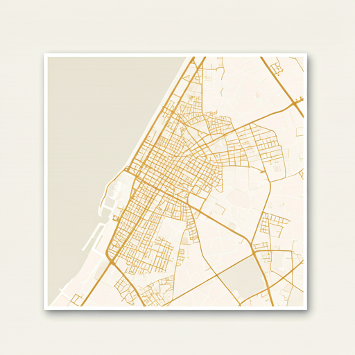
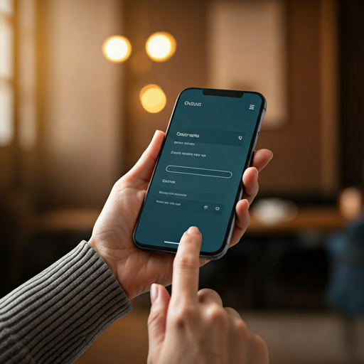
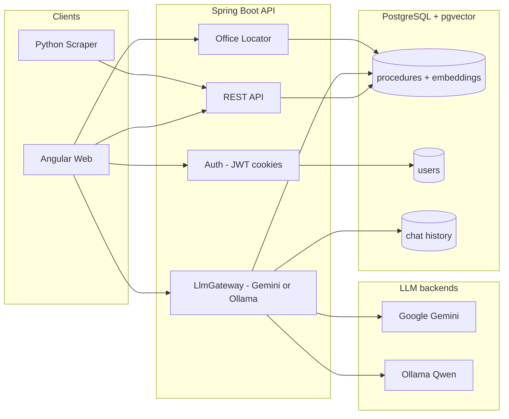

# Dosya دوسيا

**Stop guessing. Start knowing.**

Dosya is a civic tech platform that helps Tunisian citizens navigate government bureaucracy — passeport, CIN, équivalence de diplôme, résidence, and more. Every answer is grounded in **verified procedure data** stored in PostgreSQL — not improvised by AI.

Talk to it in **French, English, or Tunisian Derja** with voice guides (**Sofia · Yasmine · Alex**). Ask where to go, what papers you need, and get step-by-step guidance with sources.

> **دوسيا** — "file / dossier" in Tunisian Arabic.

<p align="center">
  
</p>

---

## Why Dosya?

| Problem | Dosya's approach |
|---------|------------------|
| Procedures scattered across ministries | Single searchable catalog |
| Word-of-mouth, outdated info | Versioned records with `sourceUrl` + `lastVerifiedAt` |
| Generic chatbots invent facts | RAG over verified `Procedure` records only |
| French / Arabic / dialect mix | FR · AR · Tunisian Derja (incl. voice agents) |
| “Where do I go?” | Nearest offices on a map when you ask |

---

## Chat & AI (Gemini · Ollama · Voice)

Dosya’s assistant is a **RAG chatbot**: it retrieves verified procedures, then asks an LLM to explain them. If the LLM is down, it still answers from procedure data (offline fallback).

### Voice agents

| Agent | Language | Role |
|-------|----------|------|
| **Sofia** | French | Clear FR civic guide |
| **Yasmine** | Tunisian Derja (TN) | Speaks / listens in Derja (Arabic script) |
| **Alex** | English | Clear EN civic guide |

- Browser **STT** (speech-to-text) + **TTS** (spoken answers)
- `agentId` is sent with `POST /api/v1/chat` so replies stay in the right language
- Prefer **Chrome** for mic + speech

### LLM providers

Set `LLM_PROVIDER` in `.env`:

| Value | Behavior |
|-------|----------|
| `auto` *(default)* | Try **Gemini** first; if missing / quota / error → **Ollama** |
| `gemini` | Google Gemini only (best for Railway / production) |
| `ollama` | Local Ollama only (no cloud key) |

| Backend | Models (defaults) | When to use |
|---------|-------------------|-------------|
| **Gemini** | `gemini-2.5-flash` (chat) + `gemini-embedding-001` (vectors) | Production, Railway, fast answers |
| **Ollama** | `qwen2.5:7b-instruct` (chat) + `nomic-embed-text` (vectors) | Local / self-hosted, no Gemini quota |
| **Offline** | Template answers from DB | Both LLMs unavailable — still useful |

Key env vars (see `.env.example`):

```bash
LLM_PROVIDER=auto          # auto | gemini | ollama
GEMINI_API_KEY=...         # required for Gemini
GEMINI_ENABLED=true
OLLAMA_ENABLED=true        # local Docker; set false on Railway
OLLAMA_BASE_URL=http://localhost:11434
OLLAMA_CHAT_MODEL=qwen2.5:7b-instruct
OLLAMA_EMBEDDING_MODEL=nomic-embed-text
```

### How RAG works

1. User message (+ optional `agentId`, history, geo)
2. Hybrid retrieval: intents / keywords + **pgvector** similarity
3. LLM rewrites the answer in the agent language (FR / Derja / EN)
4. Response includes **sources**, optional **checklist**, nearby offices if relevant

```
Structured verified data = source of truth
AI = interface only (never invent fees / documents)
```

### Local Ollama setup

```bash
docker compose up -d                 # Postgres + Ollama
.\scripts\pull-ollama-models.ps1     # pull Qwen + nomic (~5GB once)
```

Then in `.env`:

```bash
LLM_PROVIDER=ollama
OLLAMA_ENABLED=true
```

Restart the API. Chat responses should report `model: qwen2.5:7b-instruct` (not `offline-fallback`).

> **Production tip:** On Railway, use `LLM_PROVIDER=gemini` and `OLLAMA_ENABLED=false`. Self-hosting Qwen needs a large VPS/GPU; free Railway is too small for Ollama.

---

## UI preview

Design mockups live in [`design--/`](design--/) (open the HTML files in a browser for full UI). Visual assets:

<p align="center">
  
  <br/><em>Structured guidance — every procedure as a verified checklist</em>
</p>

<p align="center">
  
  <br/><em>Office locations — know where to go before you leave home</em>
</p>

<p align="center">
  
  <br/><em>AI assistant — grounded answers with sources, never invented facts</em>
</p>

Full Stitch screens: `design--/Image 13.html` (library), `Image 7.html` (detail), `Image 11.html` (chat).

---

## Architecture



---

## Tech stack

| Layer | Technology |
|-------|------------|
| Backend | Spring Boot 4, Java 21 |
| Database | PostgreSQL + pgvector |
| Migrations | Flyway |
| Frontend | Angular 19 (standalone components) |
| AI / RAG | `LlmGateway`: **Gemini** and/or **Ollama** (Qwen + nomic), hybrid retrieval |
| Voice | Browser STT/TTS · Sofia (FR) · Yasmine (TN) · Alex (EN) |
| Auth | JWT in HttpOnly cookies, Spring Security |
| Maps | Leaflet + OSRM routing |
| Scraper | Python 3, BeautifulSoup, Requests |
| Infra | Docker Compose (Postgres + Ollama) · Dockerfile · Railway |

---

## Brand palette — Modern Tunisia

| Name | Hex | Usage |
|------|-----|--------|
| Primary (Carthage Gold) | `#7e5700` | CTAs, headings |
| Primary Container | `#c8922a` | Accents |
| Secondary | `#446274` | Ministry tags |
| Background | `#fef9f1` | Page background |
| Success | `#3B6D11` | Checklist items |

---

## Project structure

```
dossia/
├── src/main/java/com/example/dossia/
│   ├── procedure/          # Domain, API, service layer
│   ├── auth/               # JWT cookie auth, users, security
│   ├── chat/               # RAG (Gemini/Ollama), voice agents, feedback, rate limit
│   ├── office/             # Office locator (nearest service point)
│   ├── common/             # Exceptions, health check
│   └── config/             # CORS, auth, Gemini, Ollama, LLM properties
├── src/main/resources/db/migration/   # Flyway SQL (incl. pgvector + feedback)
├── frontend/               # Angular 19 app
├── scraper/                # Data ingestion pipeline
├── design--/               # Stitch UI HTML mockups
├── docs/RAILWAY.md         # Deploy API + pgvector on Railway
├── Dockerfile              # Production API image
├── railway.toml            # Railway healthcheck / build
├── .env.example            # Copy to .env (shared by app + compose)
├── scripts/run-backend.ps1
├── scripts/pull-ollama-models.ps1
└── docker-compose.yml      # Postgres (pgvector) + Ollama
```

---

## Quick start

### Prerequisites

- Java 21+
- Maven (or use `./mvnw`)
- PostgreSQL with [pgvector](https://github.com/pgvector/pgvector) (or `docker compose up`)
- Node 20+ and npm (for the Angular frontend)
- Python 3.11+ (for scraper)
- **Either** a `GEMINI_API_KEY` **or** Ollama models pulled locally

### Deploy

| Piece | Where | Guide |
|-------|--------|--------|
| Backend + DB | **Railway** (use `pgvector/pgvector:pg16` image) | [`docs/RAILWAY.md`](docs/RAILWAY.md) |
| Frontend | **Vercel** | After API has a public URL + CORS |
| LLM in prod | **Gemini** (`LLM_PROVIDER=gemini`) | Ollama is optional / local |

### 1. Configure environment

```bash
cp .env.example .env
# JWT_SECRET (≥32 chars), ADMIN_EMAILS, DB creds
# GEMINI_API_KEY  and/or  Ollama (LLM_PROVIDER=auto|gemini|ollama)
```

### 2. Start the database (+ Ollama)

```bash
docker compose up -d
```

Starts **Postgres (pgvector)** and **Ollama** on `localhost:11434`. Pull models once:

```powershell
.\scripts\pull-ollama-models.ps1
```

### 3. Run the API

```bash
# Windows
.\scripts\run-backend.ps1

# macOS / Linux
./scripts/run-backend.sh
```

Or: `./mvnw spring-boot:run`

### 4. Run the frontend

```bash
cd frontend
npm install
npm start        # http://localhost:4200
```

Open **Chat** → pick **Yasmine / Sofia / Alex** → talk or type.

### 5. Verify

```bash
curl http://localhost:8080/api/v1/health
curl http://localhost:8080/api/v1/procedures
# Chat (example)
curl -X POST "http://localhost:8080/api/v1/chat?lang=tn" \
  -H "Content-Type: application/json" \
  -d "{\"message\":\"نحب نجدد الباسبور\",\"agentId\":\"yasmine\"}"
```

Check the JSON `model` field: `gemini-2.5-flash`, `qwen2.5:7b-instruct`, or `offline-fallback`.

### 6. Become an admin

Put your email in `ADMIN_EMAILS` in `.env`, then register/login with that email.  
Scraper uses `DOSSIA_ADMIN_EMAIL` / `DOSSIA_ADMIN_PASSWORD`.

After publishing procedures, embed them for vector search:

```bash
curl -X POST http://localhost:8080/api/v1/admin/procedures/embed-all
```

---

## API endpoints

### Public

| Method | Endpoint | Description |
|--------|----------|-------------|
| `GET` | `/api/v1/health` | Health check |
| `GET` | `/api/v1/procedures` | List published procedures (`?q=&category=&lang=fr`) |
| `GET` | `/api/v1/procedures/categories` | Category filter chips |
| `GET` | `/api/v1/procedures/{slug}` | Full detail (docs, steps, offices) |
| `GET` | `/api/v1/offices/nearest` | Nearest office (`?lat=&lng=&procedureSlug=&q=`) |
| `POST` | `/api/v1/chat` | RAG chat (`?lang=fr\|tn\|en\|ar`) — body may include `agentId`, `history`, geo |

### Auth

| Method | Endpoint | Description |
|--------|----------|-------------|
| `POST` | `/api/v1/auth/register` | Register (sets HttpOnly cookie) |
| `POST` | `/api/v1/auth/login` | Login (sets HttpOnly cookie) |
| `POST` | `/api/v1/auth/logout` | Clear cookie |
| `GET` | `/api/v1/auth/me` | Current user (authenticated) |

### Chat history (authenticated)

| Method | Endpoint | Description |
|--------|----------|-------------|
| `GET` | `/api/v1/chat/sessions` | List the user's chat sessions |
| `GET` | `/api/v1/chat/sessions/{id}` | Session detail with messages |
| `DELETE` | `/api/v1/chat/sessions/{id}` | Delete a session |
| `POST` | `/api/v1/chat/feedback` | Rate / report an answer |

### Admin — requires `ADMIN` role

| Method | Endpoint | Description |
|--------|----------|-------------|
| `GET` | `/api/v1/admin/procedures?status=DRAFT` | List drafts |
| `POST` | `/api/v1/admin/procedures` | Create procedure |
| `POST` | `/api/v1/admin/procedures/import` | Bulk import JSON |
| `PATCH` | `/api/v1/admin/procedures/{id}/verify` | Verify & publish |
| `POST` | `/api/v1/admin/procedures/embed-all` | Embed published procedures missing vectors |
| `GET` | `/api/v1/admin/chat/feedback` | Review chat feedback |

---

## Data ingestion (scraper)

### Source priority

| Source | Type | Mode | Notes |
|--------|------|------|-------|
| [demarches.tn](https://demarches.tn) | Community | **Auto scrape** | Primary scraper — always DRAFT + human verify |
| [services.gov.tn](https://www.services.gov.tn) | Official | Manual / partnership | Best reference content |
| interieur.gov.tn | Official | Manual | CIN, passport |
| fr.tunisie.gov.tn | Official | Manual | Ministry directory |

Registry: [`scraper/sources/sources.yaml`](scraper/sources/sources.yaml)

```bash
cd scraper
pip install -r requirements.txt
python -m sources.demarches_tn --articles --limit 10
python import_to_api.py
python import_to_api.py --verify passport-request
```

**Workflow:** scrape → normalize → human review → import → verify → embed → live.

---

## Core principle

```
Structured verified data = source of truth
AI = interface only (RAG retrieval, never freeform facts)
```

Every chat answer should cite sources (`sourceUrl` / procedure titles) when available.

---

## Roadmap

- [x] Phase 1 — Spring Boot API, PostgreSQL, Flyway, Procedure CRUD
- [x] Phase 2a — Scraper pipeline, bulk import, draft workflow
- [x] Phase 3 — Embeddings + pgvector semantic search
- [x] Phase 4 — RAG chat (Gemini) + hybrid retrieval + offline fallback
- [x] Phase 4b — Ollama / `LlmGateway` (Gemini ↔ Ollama auto-fallback)
- [x] Phase 4c — Voice agents (Sofia / Yasmine / Alex) + Derja matching
- [x] Phase 5 — Angular frontend from `design--/` mockups
- [x] Phase 6 — Auth (JWT cookies), chat history, office locator + maps
- [x] Phase 7 — Dockerfile + Railway deploy guide
- [ ] Phase 2b — Real parsers (`services.tn`, `interieur.gov.tn`, …)
- [ ] Full i18n + RTL polish
- [ ] Admin UI for verifying drafts
- [ ] Vercel frontend production wiring

---

## License

TBD

---

<p align="center">
  <strong>Dosya دوسيا</strong> — Navigating Tunisian bureaucracy, made simple.
</p>
